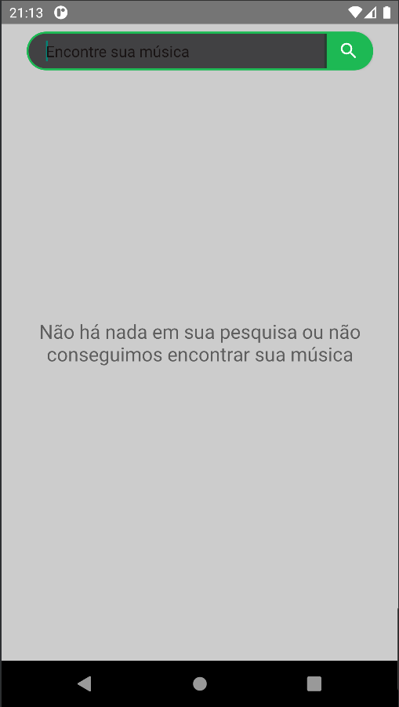
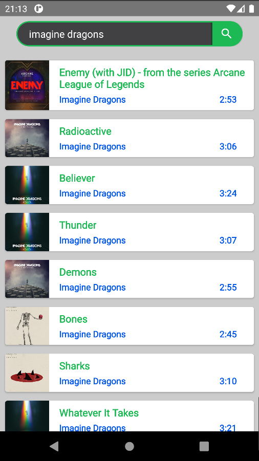
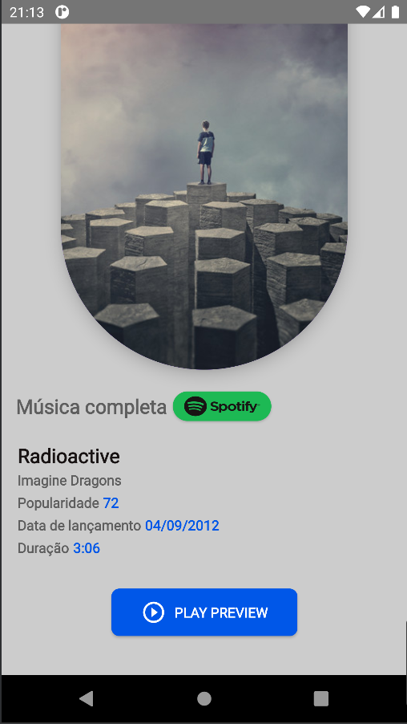

# android-music-player
## Android Music Player with Spotify API - Estudos com Android (Java)

Um aplicativo para pesquisar as músicas que deseja encontrar e escutar seus Previews e acessar diretamente o app do Spotify.

### Desenvolvimento

As seguintes bibliotecas e API`s utilizadas no projeto

- [SpotifyAPI](https://rapidapi.com/Glavier/api/spotify23/)
- [Retrofit](https://square.github.io/retrofit/)

### Imagens do App

### Video da utilização do app
https://www.loom.com/share/1f11b5f5cb664c8087b7bdaa5c3837f5
